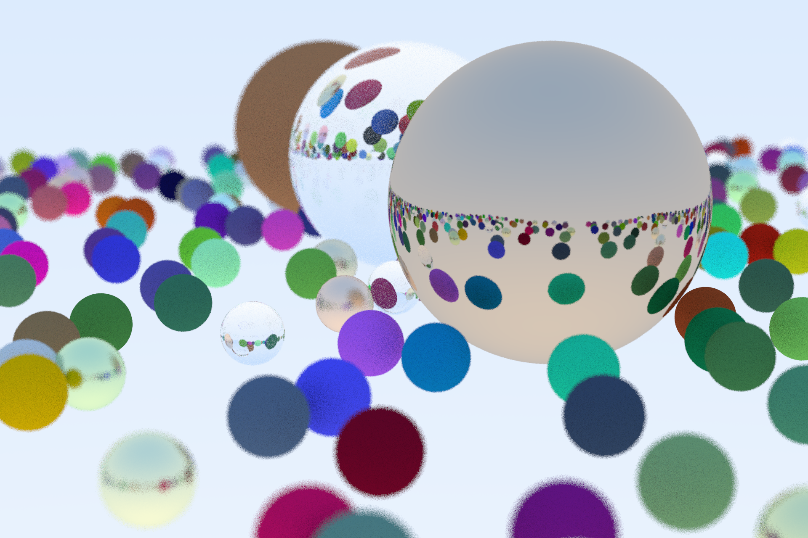

# CPP-Raytracer
This is a repository of my Raytracer created from scratch in C++. Resources : Scratchapixel and "Ray Tracing in One Weekend"

FEATURES :
- Customizable Camera. Change FOV, Position + Orientation, Depth of Field, Aspect Ratio, Aperture, Motion Blur.
- Simple Shapes like Spheres, Moving Spheres, Planes, Axis-Aligned Bounding Boxes.
- Fully Raytraced scenes.
- Per pixel multisampling using Monte Carlo approximation methods.
- Inheritable Material class for custom materials.
- Simple to use world generator.
- Bounding Volume Hierarchy Node

FEATURE ROADMAP :
- More simple shapes. [Cylinder, Cone, Cube, Paraboloid]
- Bounding Volume Hierarchy[BVH]. => DONE.
- Lights and Shadows.
- Parallelizing the main render loop. [CUDA]
- Direct PNG Image formation.
- Denoiser.
- GUI to change camera properties.

Current Output for Raytraced Scene :

